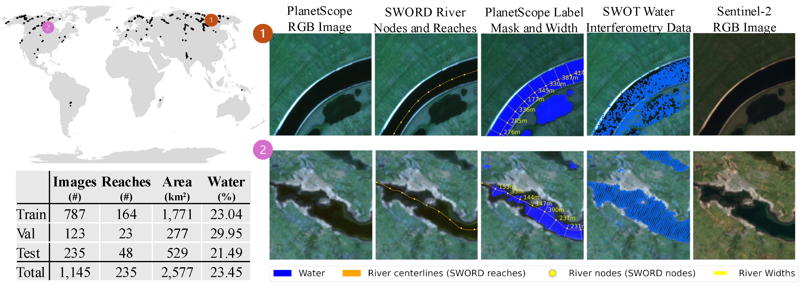
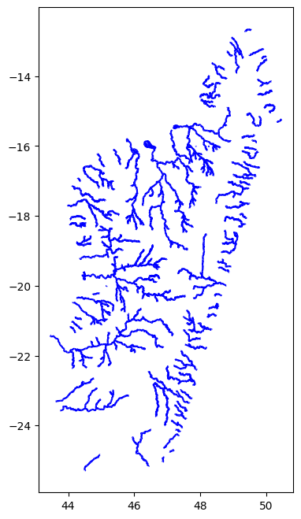

# RiverScope: High-Resolution River Masking Dataset

This repository contains information about the dataset.
For information about training and models, go to: [RiverScope models](https://github.com/cvl-umass/riverscope-models)


## Table of contents
1. [Dataset download](#dataset-download)
2. [Dataset Structure](#dataset-structure)
    1. [PlanetScope](#planetscope)
        1. [Input](#input)
        2. [Labels](#labels)
    2. [Sentinel-2](#sentinel-2)
    3. [SWORD](#sword)
    4. [SWOT](#swot)

## Dataset Download
Download the dataset from the following: [https://zenodo.org/records/15376394](https://zenodo.org/records/15376394) (the data is about 8GB zipped, 10GB unzipped)

Alternatively you can run the following:
```
wget https://zenodo.org/records/15376394/files/RiverScope.zip
```

## Dataset Structure
```
📦 RiverScope
├─ PlanetScope
│  ├─ input
│  │  ├─ train (contains *.tif)
│  │  ├─ valid (contains *.tif)
│  │  └─ test (contains *.tif)
│  ├─ label
│  │  ├─ train (contains *.tif)
│  │  ├─ valid (contains *.tif)
│  │  └─ test (contains *.tif)
│  └─ derived_gt_widths-test.csv
├─ Sentinel-2
│  ├─ raw
│  │  ├─ train (contains *.tif)
│  │  ├─ valid (contains *.tif)
│  │  └─ test (contains *.tif)
│  └─ reprojected
│     ├─ train (contains *.tif)
│     ├─ valid (contains *.tif)
│     └─ test (contains *.tif)
├─ SWORD (contains *.shp)
│  └─ SWORD_nodes.csv
├─ SWOT
│  ├─ nodes (contains *.geojson)
│  └─ pixc (contains *.tif)
├─ train.csv
├─ valid.csv
└─ test.csv
```
<!-- ©generated by [Project Tree Generator](https://woochanleee.github.io/project-tree-generator) -->

1. There are 4 types of data: (1) PlanetScope, (2) Sentinel-2, (3) SWORD, (4) SWOT. Each has its own folder.
2. In the upper level, there are 3 csv files defining the data for each split: train/valid/test. Each csv file contains the following columns:

| Column                        | Data Type | Description |
| ---                           |  ---      | --- |
| reach_id                      | int       | The ID of the reach contained in the image |
| mid_lat                       | float     | Latitude of the middle of the tile crop    |
| mid_lon                       | float     | Longitude of the middle of the tile crop    |
| planetscope_id                | str       | Identifier of the PlanetScope image used for the tile. Can be used to download the raw data. |
| normalized_planetscope_path   | str       | Relative path of the normalized PlanetScope data, cropped to 500x500 pixels that matches the same area as the label.    |
| label_path                    | str       | Relative path of the  water segmentation label for the given PlanetScope tile. [0=background, 1=river, 2=other water]  |
| sword_path                    | str       | Relative path of the SWORD vector file that contains the nodes and reaches.   |
| s2_path_raw                   | str       | Relative path of the raw Sentinel tile that contains the area captured by the PlanetScope tile |
| s2_path_reprojected           | str       |  Relative path of the Sentinel tile that was reprojected and cropped to the same area as the PlanetScope tile    |
| swot_node_path                | str       | Relative path of the node data contained in the given image/area     |
| swot_node_id                  | str       | Identifier of the SWOT node data, can be used to download the full,raw data |
| swot_pixc_path                | str       | Relative path of the rendered pixel cloud from SWOT |
| swot_pixc_id                  | str       |Identifier of the SWOT pixel cloud, can be used to download the full,raw data       |


### PlanetScope
Data type: .tif (both input and label)

PlanetScope is the high-resolution satellite image data (3m/pixel). 

#### Input
It has 4 bands: B,G,R,NIR (in this order) and all bands have 3m/pixel resolution.

| Band  | Name  |
| ---   | ---   |
|   1   | Blue  |
|   2   | Green |
|   3   | Red   |
|   4   | NIR   |

All .tif files can be read and processed using the python library [rasterio](https://rasterio.readthedocs.io/en/stable/).
```python
import rasterio

img_metadata = rasterio.open(satellite_fp)  # you can use this to determine the projection, extent, etc
img_data = img_metadata.read()              # this will read all available bands and will be a numpy array of shape (bands, H, W)
```
#### Labels
It is a single band label with the following values per pixel:
| Value  | Description  |
| ---   | ---   |
|   0   | Background (non-water)  |
|   1   | River water |
|   2   | Non-river water (e.g., lakes, points, etc)   |


### Sentinel-2
Data type: .tif

Sentinel-2 is the lower-resolution satellite image data (10m/pixel for RGB+NIR). It has 12 bands. We include two versions: the `raw` and the `reprojected`.
1. `raw`: this contains the raw, unreprojected, unnormalized Sentinel-2 bands downloaded from [Sentinel Hub](https://www.sentinel-hub.com/)
2. `reprojected`: this contains the sentinel images that were reprojected to be in the same view and area as the corresponding PlanetScope images. The bands are not normalized, but are interpolated from the raw bands to match the PlanetScope projection. This is useful for visually comparing Sentinel to PlanetScope. Note that the images here were bilinearly upsampled to have the same size as PlanetScope.
The data in Sentinel-2 can be read in the same way as PlanetScope in the previous section.

Below are the available bands. For more information, please see [here](https://docs.sentinel-hub.com/api/latest/data/sentinel-2-l2a/#available-bands-and-data). Note that B10 is only used for atmospheric correction and is not included.

| Band  | Name                  |  Resolution (m/pixel) |
| ---   | ---                   | ----                  |
|   1   | Aerosol               | 60                    |
|   2   | Blue                  | 10                    |
|   3   | Green                 | 10                    |
|   4   | Red                   | 10                    |
|   5   | Vegetation Red Edge   | 20                    |
|   6   | Vegetation Red Edge   | 20                    |
|   7   | Vegetation Red Edge   | 20                    |
|   8   | NIR                   | 10                    |
|   8A  | Narrow NIR            | 20                    |
|   9   | Water Vapor           | 60                    |
|   11  | SWIR1                 | 20                    |
|   12  | SWIR2                 | 20                    |


### SWORD
Data types: .shp, .cpg, .dbf, .prj, .shx

SWORD is the reference for all rivers used by SWOT and other methods. It defines nodes (points along the river spaced ~200m apart) and reaches (line segments defining rivers ~10km long). The main file is the `.shp` and the other extensions are supporting files. The `.shp` file is a vector that defines the river centerlines. If you wish you visualize the data, you can use a software [QGIS](https://qgis.org/). Alternatively, you can use python to read the data with the library [geopandas](https://geopandas.org/en/stable/):
```python
import geopandas as gpd

line_gdf = gpd.read_file(sword_shp_path)        # this is a geopandas dataframe that you can print
print(line_gdf)                                 # prints all attributes as a dataframe. The 'geometry' column can be used for visualization. One line in the dataframe is one reach.

import matplotlib.pyplot as plt
fig, ax1 = plt.subplots(1, 1, figsize=(8, 8))
line_gdf.plot(ax=ax1, color='blue', label='River reach')        # this visualizes the reaches contained in the shapefile.
```
<!--  -->


Data type: .csv

There is a csv file that contains the reference nodes available in SWORD (`SWORD_nodes.csv`). This supplements the raw shapefiles which contain reach-level information. This contains the node-level information such as the estimated widths.

### SWOT
Data types: .tif (for pixc), .geojson (for nodes)

SWOT has multiple products available. As part of our dataset we release the 3D pixel cloud (PIXC), and the node-level data (RiverSP Node). To reduce the size of our dataset, we release PIXC to be rendered in the same projection and area as the corresponding PlanetScope images. To obtain the raw files, you can refer to the `swot_node_id` and `swot_pixc_id` in the `train/valid/test.csv` files.
1. `pixc`: this contains the projected pixel cloud from the raw file. This is used to visualize the SWOT data before it's processed/aggregated along nodes/reaches.
2. `nodes`: this contains the aggregated data from `pixc`. Data is aggregated into nodes (points along the river spaced around 200m apart) based on the pixels identified as water from `pixc`. This contains the SWOT-derived widths per node. You can read this file in python using [pandas](https://pandas.pydata.org/):
```python
import pandas as pd

node_data = pd.read_csv(nodes_fp)
```
